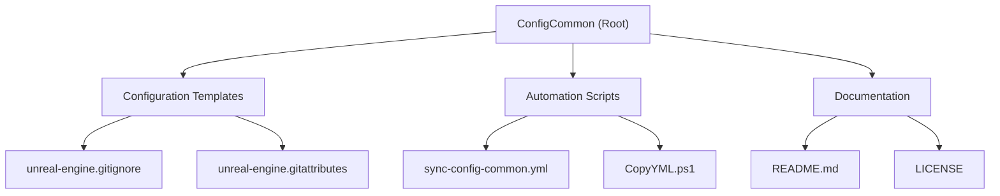

# ConfigCommon

## Changelog
- **2025-09-26**: Initial AI context initialization by Claude Code
  - Created comprehensive project documentation
  - Added .gitignore and .gitattributes files for ConfigCommon project
  - Established module structure documentation
  - Added Mermaid architecture diagram

## Project Vision
ConfigCommon is a centralized repository for maintaining and distributing common configuration files across multiple development projects. It provides automated synchronization capabilities through GitHub Actions workflows and PowerShell scripts, ensuring consistency in development environments, build configurations, and project setup across different repositories.

## Architecture Overview



## Module Index

| Module | Path | Type | Description | Entry Points |
|--------|------|------|-------------|--------------|
| Root Configuration | `.` | Configuration Repository | Main configuration templates and automation scripts | `sync-config-common.yml`, `CopyYML.ps1` |

## Key Components

### GitHub Actions Workflow
- **File**: `sync-config-common.yml`
- **Purpose**: Automated synchronization of configuration files from ConfigCommon to target repositories
- **Features**: 
  - Configurable file sync options (.gitignore, .gitattributes, .editorconfig, .clang-format)
  - Scheduled execution (weekly) and manual trigger
  - Support for additional custom files
  - Automatic commit and push capabilities

### PowerShell Automation Script
- **File**: `CopyYML.ps1`
- **Purpose**: Local PowerShell script for batch deployment of sync workflows to multiple repositories
- **Features**:
  - Multi-repository batch processing
  - Automatic git operations (clone, pull, commit, push)
  - Temporary directory management
  - Interactive confirmation for push operations

### Configuration Templates
- **Unreal Engine Templates**: Specialized .gitignore and .gitattributes for Unreal Engine projects
  - Binary file handling with Git LFS
  - Engine-specific exclusions (Binaries, Intermediate, DerivedDataCache)
  - Asset management for large game development files

## Running and Development

### Using GitHub Actions Workflow
1. Copy `sync-config-common.yml` to target repository's `.github/workflows/` directory
2. Configure workflow inputs as needed
3. Trigger manually or wait for scheduled execution (Mondays 2:00 AM UTC)

### Using PowerShell Script
```powershell
# Basic usage
.\CopyYML.ps1 -TargetRepositories @("username/repo1", "username/repo2")

# With custom settings
.\CopyYML.ps1 -TargetRepositories @("username/repo1") -SourceRepo "dadavidtseng/ConfigCommon" -ConfigFile "sync-config-common.yml"
```

### Configuration File Sync Options
- **.gitignore**: Sync gitignore files (default: enabled, source: unreal-engine.gitignore)
- **.gitattributes**: Sync gitattributes files (default: enabled, source: unreal-engine.gitattributes)
- **.editorconfig**: Sync editor config files (default: enabled)
- **.clang-format**: Sync clang-format files (default: disabled)
- **Additional Files**: Custom file pairs in format `local_file:remote_file`

## Testing Strategy
- Manual verification of file synchronization
- Git repository state validation
- PowerShell script error handling testing
- GitHub Actions workflow execution monitoring

## Coding Standards
- **YAML**: Follow GitHub Actions workflow syntax standards
- **PowerShell**: Use approved verbs, proper error handling, and comprehensive logging
- **Documentation**: Maintain clear inline comments and comprehensive README files
- **Version Control**: Use semantic commit messages following conventional commits

## AI Usage Guidelines
- Use AI assistance for generating configuration templates for new platforms
- Validate automated synchronization logic before deployment
- Ensure proper error handling in automation scripts
- Maintain documentation accuracy with AI-generated updates

## File Structure
```
ConfigCommon/
├── .gitignore                     # Project-specific ignore rules
├── .gitattributes                 # Project-specific git attributes
├── README.md                      # Basic project information
├── LICENSE                        # Apache 2.0 license
├── sync-config-common.yml         # GitHub Actions workflow template
├── CopyYML.ps1                   # PowerShell deployment script
├── unreal-engine.gitignore       # Unreal Engine gitignore template
├── unreal-engine.gitattributes   # Unreal Engine gitattributes template
└── .claude/
    ├── index.json                # AI context index
    └── CLAUDE.md                  # This documentation
```

## Configuration Management
- Configuration templates are stored at repository root level
- Templates follow naming convention: `{platform/technology}.{filetype}`
- Automation scripts support configurable source file selection
- Version control tracks all configuration changes with detailed commit messages

## Related Resources
- [GitHub Actions Documentation](https://docs.github.com/en/actions)
- [PowerShell Best Practices](https://docs.microsoft.com/en-us/powershell/scripting/developer/cmdlet/cmdlet-development-guidelines)
- [Git LFS Documentation](https://git-lfs.github.io/)
- [Unreal Engine Version Control Guidelines](https://docs.unrealengine.com/5.0/en-US/using-version-control-with-unreal-engine/)